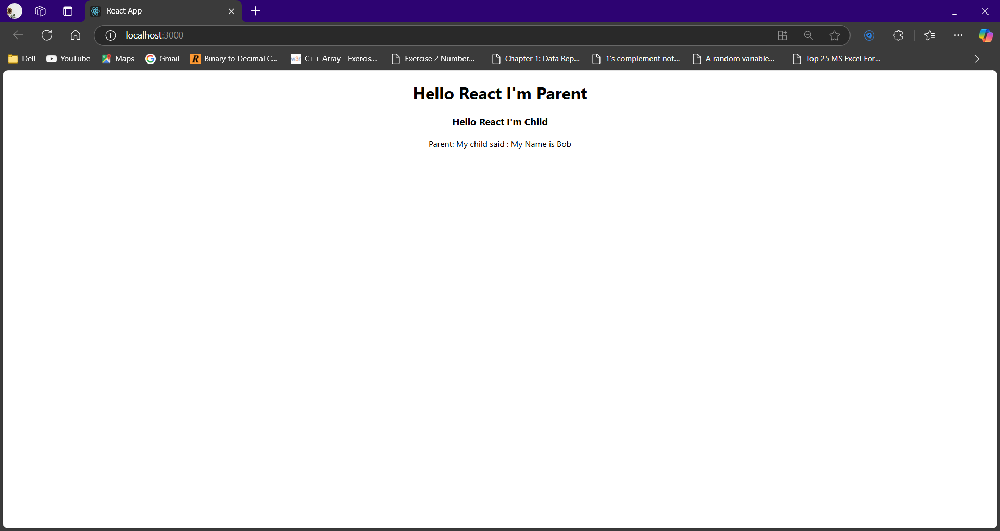

# React Practical Day 07: Parent-Child Communication
# 2020ICT91

This React practical demonstrates parent-to-child and child-to-parent communication using props and state in a functional component setup.

---

## **Project Overview**

### **Files**
1. **App.js**: Contains the parent component that manages state and passes a callback function to the child component.
2. **Childcom.js**: Represents the child component, which uses the parent's callback to send data back.

### **Key Concepts Covered**
- **State Management**: Using `useState` to manage and update the parent's state.
- **Props**: Passing data and functions between components.
- **Callback Functions**: Enabling the child component to send data back to the parent.

---

## **How It Works**
1. The `App` component (Parent) defines a state variable `childname` and a function `receiveName` to update it.
2. The `Childcom` component (Child) receives the parent's function as a prop and uses it to send a message ("My Name is Bob") back to the parent.
3. The parent component updates its `childname` state and displays the message sent by the child.

---

## **How to Run**
1. Clone the repository and navigate to the project directory.
2. Install dependencies:
   ```bash
   npm install
   ```
3. Navigate to project Folder
```bash
   cd day07
   ```
4. Run Project
```bash
   npm start
   ```
5. Open your browser and navigate to http://localhost:3000.

# Output
